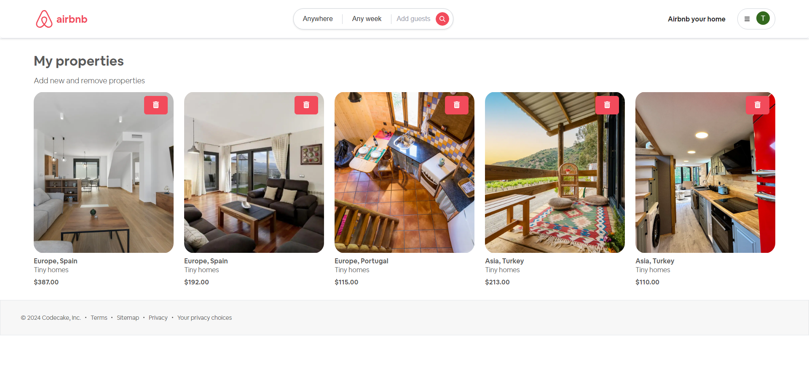
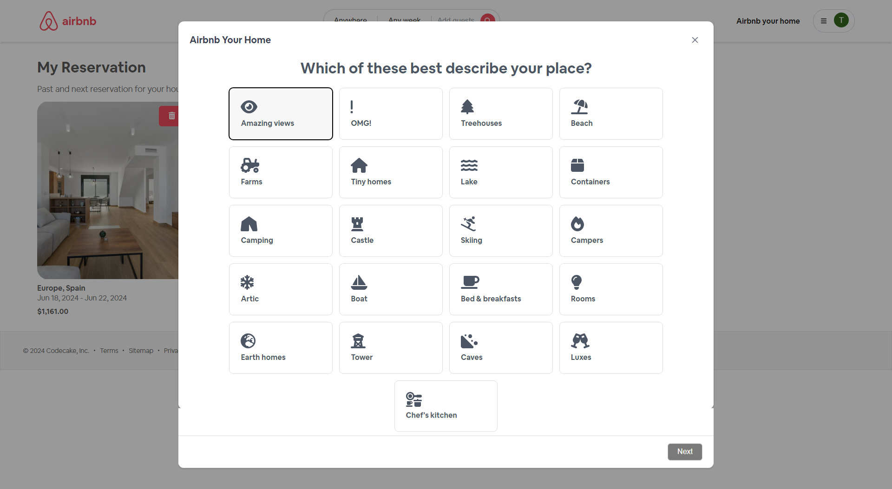
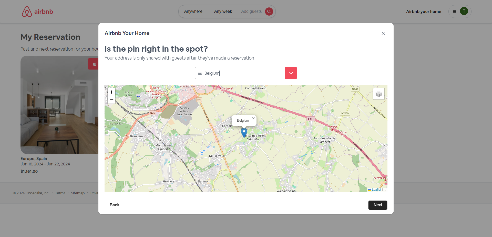
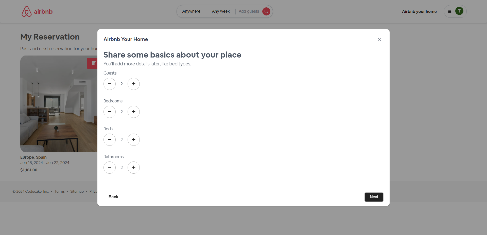
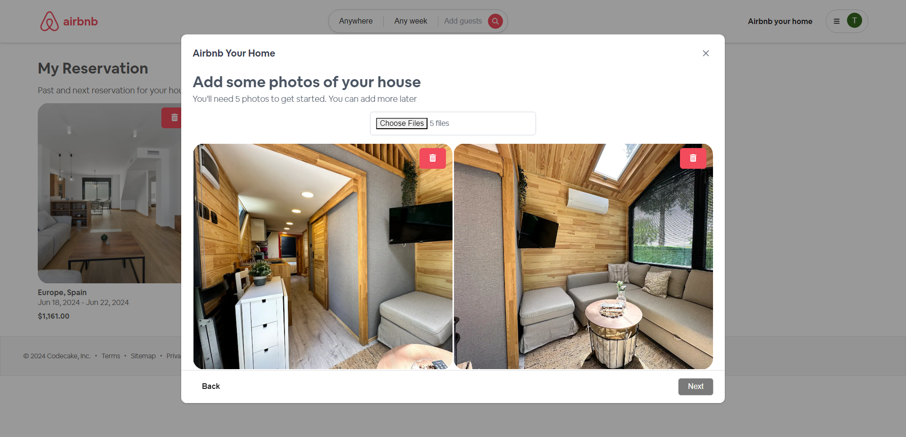
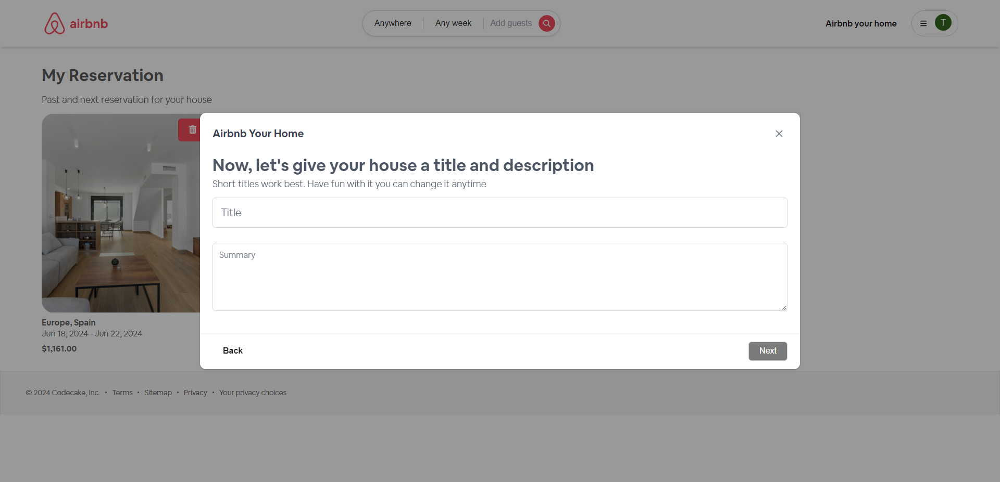
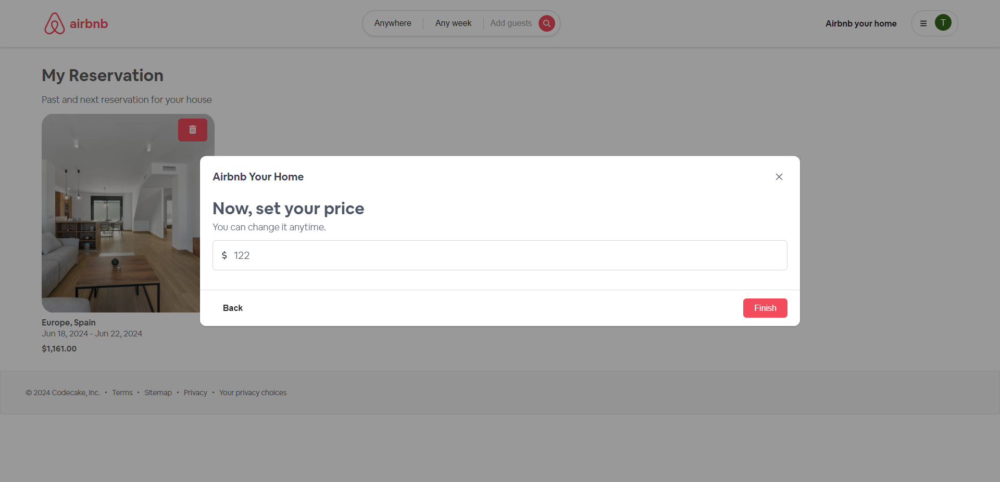
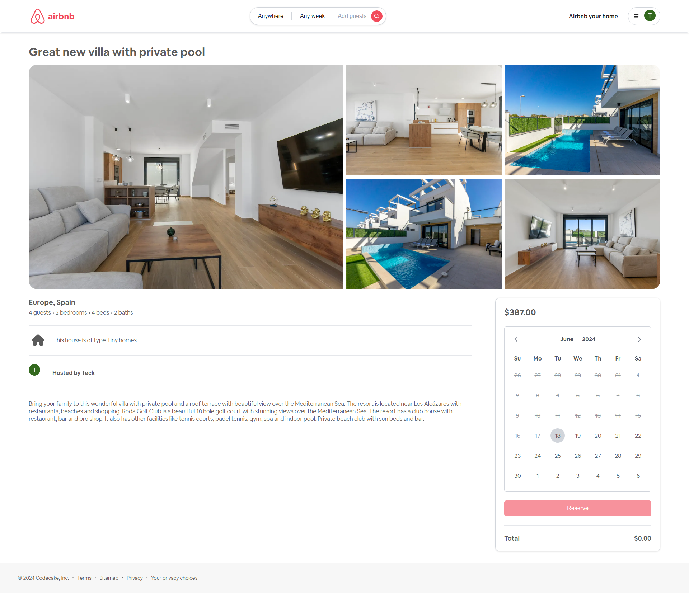
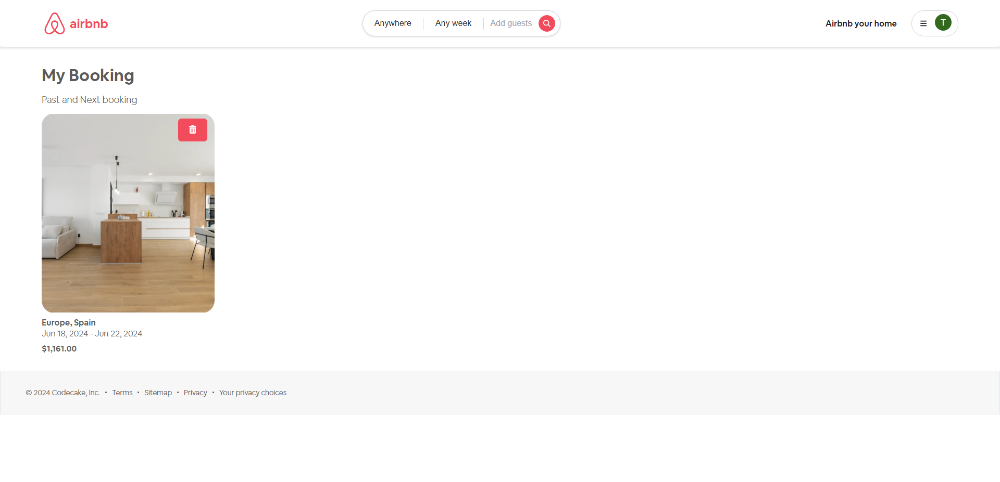
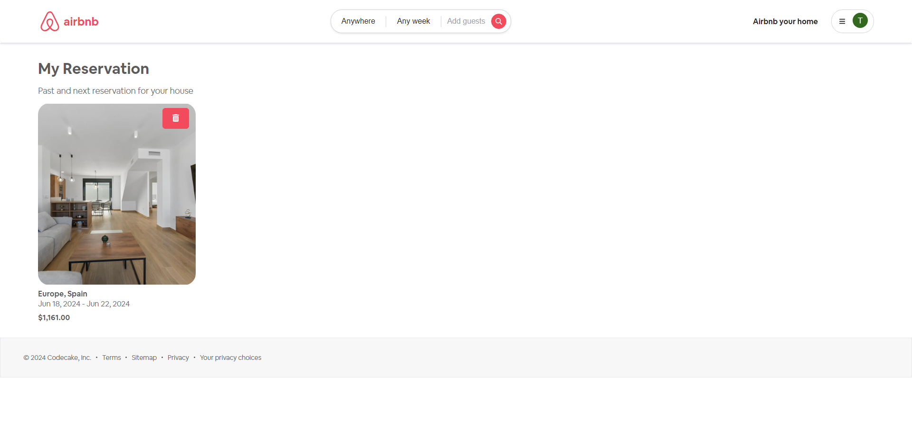

# Airbnb Clone Application
##### Using  Spring Boot V3 & Angular V17


## Features

- login & register using Okta Auth0
- Displaying house by category
- Booking.
- Reservation.
- Search.


## Installation

airbnb-clone-application requires [Node.js](https://nodejs.org/) v20.13.1+ to run & JavaJdk V17+.

Install the dependencies and devDependencies and start the server.

#### Server
```sh
cd airbnb-clone-server
mvn clean install
## //On target folder ru this command
java -jar your_file_name.jar
```

For .env file

```sh
AUTH0_CLIENT_ID= Your_AUTH0_CLIENT_ID
AUTH0_CLIENT_SECRET= Your_AUTH0_CLIENT_SECRET
```

#### Client
```sh
cd airbnb-clone-client
npm i
ng serve --open
```
#### Docker
```sh
cd airbnb-clone-server
docker compose build
docker compose up
```

## Libraries

Clips Video Sharing is currently created with the following libraries.
Instructions on how to use them in your own application are linked below.

| Plugin | NPM | Version |
| ------ | ------ | ------ |
| leaflet | [https://www.npmjs.com/package/leaflet][Leaflet] | 1.9.4
| ngx-leaflet | [https://www.npmjs.com/package/@asymmetrik/ngx-leaflet][NGXLeaflet] | 17.0.0
| leaflet-geosearch | [https://www.npmjs.com/package/leaflet-geosearch][LeafletGeosearch] | 4.0.0
| angular-fontawesome | [https://www.npmjs.com/package/@fortawesome/angular-fontawesome][AngularFontawesome] | 0.14.1
| dayjs | [https://www.npmjs.com/package/dayjs][DayJs] | 1.11.11
| primeng | [https://www.npmjs.com/package/primeng][PrimeNg] | 17.17.2
| primeflex | [https://www.npmjs.com/package/primeflex][PrimeFlex] | 3.3.1

> Note:  you cand find more in `package.json` file.

[⬆ back to top](#airbnb-clone-application)

## Screenshots
##### Home Page

[⬆ back to top](#airbnb-clone-application)

##### Category

[⬆ back to top](#airbnb-clone-application)

##### Map

[⬆ back to top](#airbnb-clone-application)

##### Room Information

[⬆ back to top](#airbnb-clone-application)

##### Room Photos

[⬆ back to top](#airbnb-clone-application)

##### Room Details

[⬆ back to top](#airbnb-clone-application)

##### Room Price

[⬆ back to top](#airbnb-clone-application)

##### Booking Details

[⬆ back to top](#airbnb-clone-application)

##### My Booking

[⬆ back to top](#airbnb-clone-application)

##### My Reservation

[⬆ back to top](#airbnb-clone-application)
## License

MIT

**Free Software, Hell Yeah!**

[//]: # (These are reference links used in the body of this note and get stripped out when the markdown processor does its job. There is no need to format nicely because it shouldn't be seen. Thanks SO - http://stackoverflow.com/questions/4823468/store-comments-in-markdown-syntax)

[dill]: <https://github.com/joemccann/dillinger>
[git-repo-url]: <https://github.com/joemccann/dillinger.git>
[john gruber]: <http://daringfireball.net>
[df1]: <http://daringfireball.net/projects/markdown/>
[markdown-it]: <https://github.com/markdown-it/markdown-it>
[Ace Editor]: <http://ace.ajax.org>
[node.js]: <http://nodejs.org>
[Twitter Bootstrap]: <http://twitter.github.com/bootstrap/>
[jQuery]: <http://jquery.com>
[@tjholowaychuk]: <http://twitter.com/tjholowaychuk>
[express]: <http://expressjs.com>
[AngularJS]: <http://angularjs.org>
[Gulp]: <http://gulpjs.com>

[Leaflet]: <https://www.npmjs.com/package/leaflet>
[NGXLeaflet]: <https://www.npmjs.com/package/@asymmetrik/ngx-leaflet>
[LeafletGeosearch]: <https://www.npmjs.com/package/leaflet-geosearch>
[AngularFontawesome]: <https://www.npmjs.com/package/@fortawesome/angular-fontawesome>
[DayJs]: <https://www.npmjs.com/package/dayjs>
[PrimeNg]: <https://www.npmjs.com/package/primeng>
[PrimeFlex]: <https://www.npmjs.com/package/primeflex>
